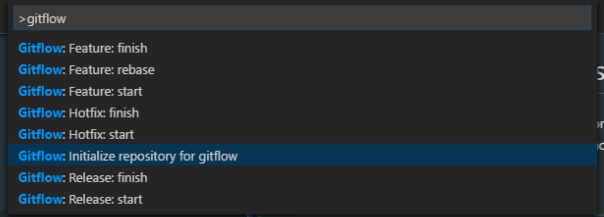

# Gitflow integration for Visual Studio Code

This extension provides integration and support for [gitflow](http://nvie.com/posts/a-successful-git-branching-model/).
It is based on [this gitflow implementation](https://github.com/nvie/gitflow)
and intends to be fully compatible with it.

# Getting Started

If you already have gitflow set up for your repository, just start execcuting
gitflow commands from the Command Palette!


## Starting from Scratch

1. First, initialize git:
```sh
$ git init
```
2. Open the VS Code Command Palette and type 'gitflow'

3. Select 'Initialize repository for gitflow'


4. Follow the command prompts and accept the defaults...


5. Setup complete!

### Note

Development is ongoing. Please help support this project by trying it out
and submitting issues and feature requests to [the github page](https://github.com/vector-of-bool/vscode-gitflow).
